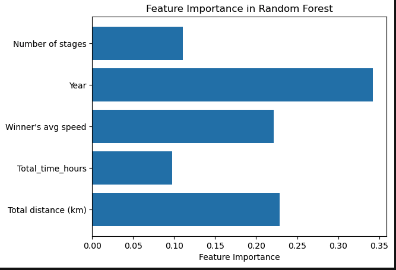

---

# 🚴‍♂ Tour de France Analysis

This project explores **over a century** of Tour de France data to uncover historical trends and apply **machine learning** to predict the **winner's country** based on race characteristics.

---

##  Key Features[kaggle.com]

*  **Exploratory Data Analysis (EDA)**

  * Visualized trends in:

    * Race distance
    * Average speed
    * Stage count
    * Nationality of winners (1903 to present)

*  **Feature Engineering**

  * Created meaningful features like:

    * Average speed
    * Race duration
    * Total distance

*  **Target Encoding**

  * Used `LabelEncoder` to encode categorical data such as the **winner's country** for model compatibility.

*  **Model Training**

  * Trained:

    * **Random Forest Classifier**
    * **Decision Tree Classifier**
  * Input features included race year, distance, stages, etc.

*  **Model Evaluation**

  * Evaluated performance using:

    * Accuracy scores
    * Confusion matrices
    * Per-country prediction accuracy

*  **Insights**

  * France and Belgium emerged as dominant cycling nations.
  * Some confusion between similar cycling powers (e.g., **Spain** vs. **Italy**) identified through heatmaps.

---

##  Visualizations

### 📌 Feature Importance

### 📌 Confusion Matrix

### 📌 Outliers

### 📌 Model Accuracy

---

## 🛠️ Tools & Skills Used

* Python
* pandas
* matplotlib, seaborn
* scikit-learn
* Data preprocessing
* Machine Learning (Classification)
* Data Visualization

---

## Author
* Mary Eyeson
* Data Analysis & Machine Learning Enthusiast
* Dallas, TX
